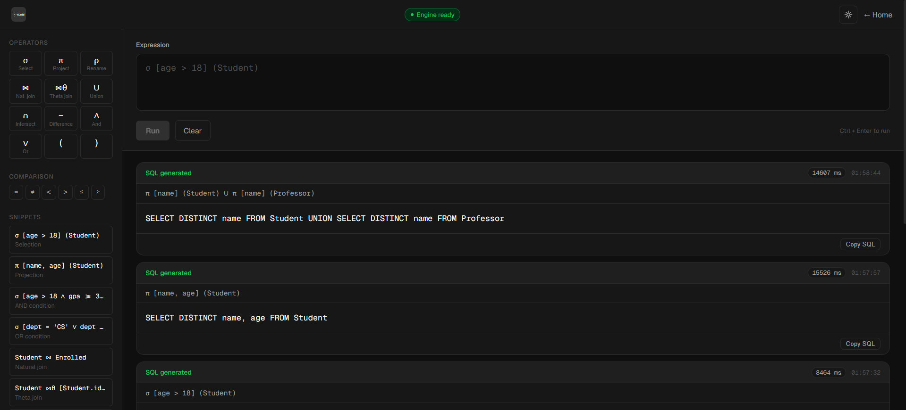
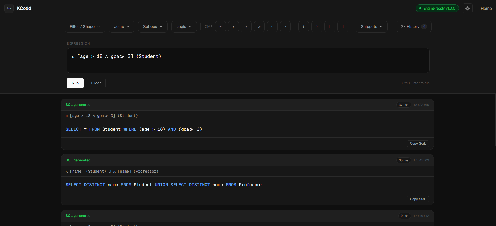
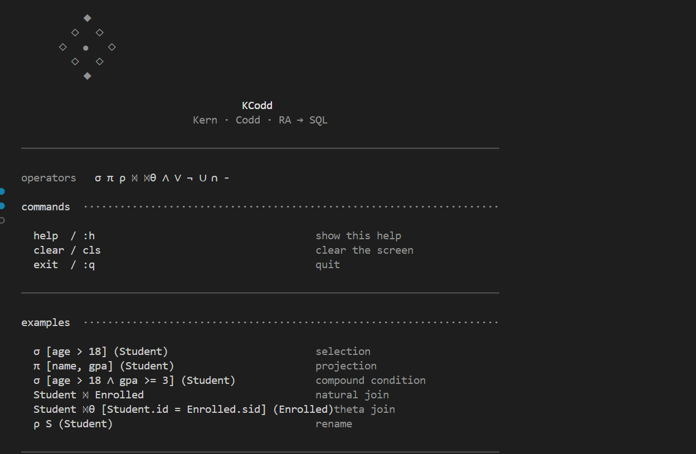
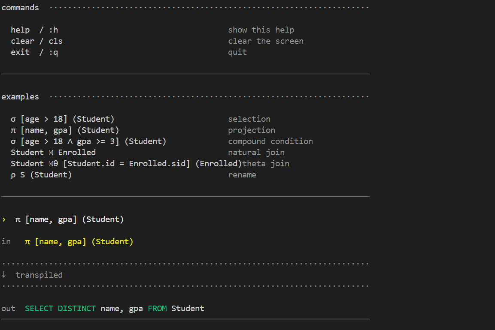
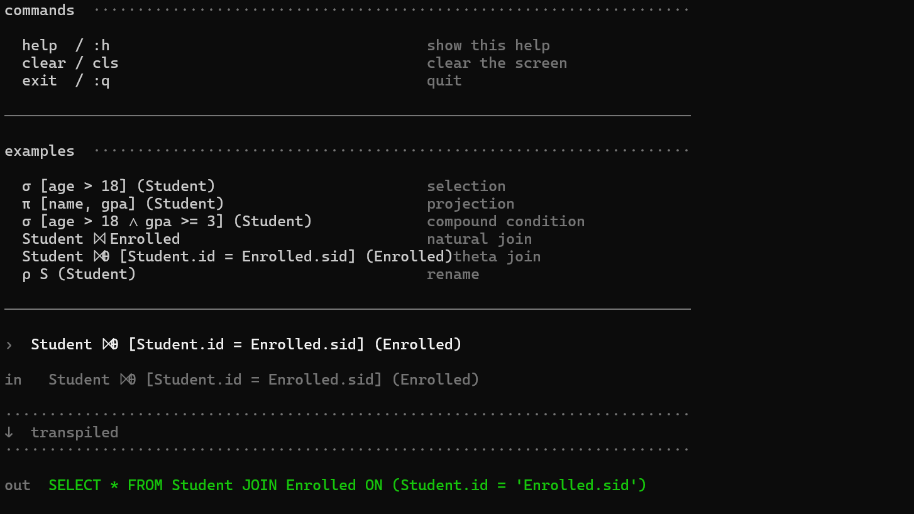
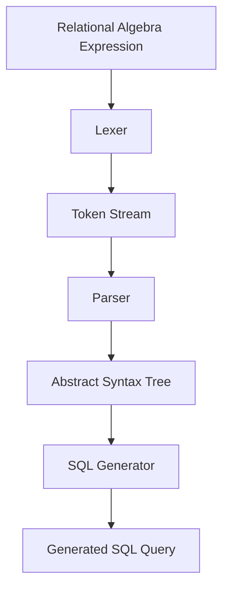
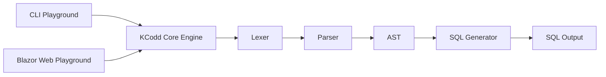

# KCodd

<p align="center">
  
</p>

<p align="center">
  
  
  
  <a href="https://kcodd.onrender.com">
    
  </a>
  
</p>
<p align="center">
  <strong>Relational Algebra → SQL Transpiler</strong>
</p>

<p align="center">
  π  σ  ⋈  ρ  ∪  ∩
</p>

<p align="center">
  A lightweight compiler-style engine for parsing relational algebra expressions,
  building ASTs, and transpiling them into SQL queries.
</p>

---

> *Kern* — the core beneath everything.  
> *Codd* — Edgar F. Codd, who gave the relational model to the world.

KCodd is a relational algebra engine born from curiosity about database internals — how queries really work beneath the surface of SQL.

It parses relational algebra expressions, builds Abstract Syntax Trees (ASTs), and generates readable SQL targeting standard SQL dialects.

---

## Live Playground

Try it out → [kcodd.onrender.com](https://kcodd.onrender.com)

---
### Supported Operators

| Operator | Symbol | Status |
|---|---|---|
| Selection | σ | ✅ |
| Projection | π | ✅ |
| Rename | ρ | ✅ |
| Natural Join | ⋈ | ✅ |
| Theta Join | ⋈θ | ✅ |
| Union | ∪ | ✅ |
| Intersection | ∩ | ✅ |
| Difference | − | ✅ |

---

## Project Context

KCodd is a relational algebra → SQL transpiler focused on
compiler-style query processing.

It parses relational algebra expressions, builds Abstract Syntax Trees (ASTs),
and generates readable SQL targeting standard SQL dialects.

The project explores:
- relational theory
- compiler architecture
- parsing systems
- AST transformations
- query generation
- database internals

---


## Highlights

- Relational Algebra → SQL transpilation
- Compiler-style architecture (Lexer → Parser → AST → SQL)
- Interactive Blazor playground
- CLI playground
- E2E and parser testing
- Dark/light theme
- Nested relational algebra expressions
---

## Playground Preview

### Web Playground
<p align="center">

<br>
<br>

</p>

### CLI Playground
<p align="center">

</p>

<p align="center">

</p>

<p align="center">
  
</p>


---

## Current Status

> Current version: `v1.0.0`

> **In Active Development** 

---

## ✅ Currently supported Operators

- **Selection (σ)** 

- **Projection (π)**

- **Natural Join (⋈)** 

- **Theta Join (⋈θ)**

- **Rename (ρ)** 

- **Union (∪)** 

- **Intersection (∩)**

- **Difference (−)**


---

## Getting Started

### Prerequisites

- .NET 9 or later


```bash 
git clone https://github.com/AboubacarSow/kcodd.git
```
Or you prefer SSH mode
```bash
git clone git@github.com:AboubacarSow/kcodd.git

```
### Build Solution 
```bash 
dotnet build kcodd.sln
```
### Test 

```bash
dotnet test --project tests/tests.csproj
```
### CLI Playground

```bash
cd playground/cli
dotnet run
```

### Example Queries

```text
σ [age > 18] (Student)

π [name, gpa] (Student)

Student ⋈ Enrolled

Student ⋈θ [Student.id = Enrolled.student_id] Enrolled
```

### Web Playground

```bash
cd playground/webBlazor
dotnet run
```

Open:

```text
https://localhost:7200
```

---

# Examples

## Selection with complex condition

```text
σ [age > 18 ∧ gpa ≥ 3.0] (Student)
```

```sql
SELECT *
FROM Student
WHERE age > 18 AND gpa >= 3.0;
```

---

## Projection after selection

```text
π [name, gpa] (σ [age > 18] (Student))
```

```sql
SELECT DISTINCT name, gpa
FROM Student
WHERE age > 18;
```

---

## Natural Join

```text
Student ⋈ Enrolled
```

```sql
SELECT *
FROM Student
NATURAL JOIN Enrolled;
```

---

## Theta Join

```text
Student ⋈θ [Student.id = Enrolled.student_id] Enrolled
```

```sql
SELECT *
FROM Student
JOIN Enrolled
ON Student.id = Enrolled.student_id;
```

---

## Union

```text
(Student ∪ Alumni)
```

```sql
SELECT *
FROM Student
UNION
SELECT *
FROM Alumni;
```

---

## Intersection

```text
(Student ∩ HonorStudents)
```

```sql
SELECT *
FROM Student
INTERSECT
SELECT *
FROM HonorStudents;
```

---

## Difference

```text
(Student − GraduatedStudents)
```

```sql
SELECT *
FROM Student
EXCEPT
SELECT *
FROM GraduatedStudents;
```

---

## Multi-table pipeline

```text
π [name, title]
(
    Student
    ⋈θ [Student.id = Enrolled.student_id] Enrolled
    ⋈θ [Enrolled.course_id = Course.id] Course
)
```

```sql
SELECT DISTINCT name, title
FROM Student
JOIN Enrolled
    ON Student.id = Enrolled.student_id
JOIN Course
    ON Enrolled.course_id = Course.id;
```

---

# Architecture

## Project Structure

```text
kcodd/
├── src/
│   ├── core/           # AST node definitions and core logic
│   ├── lexer/          # Lexical analysis
│   ├── parser/         # Syntax parsing
│   ├── sqlgenerator/   # SQL code generation
│   ├── transpiler/     # Main transpilation service
│   └── grammar/        # Formal grammar definitions
│
├── playground/
│   ├── cli/            # Command-line playground
│   └── webBlazor/      # Blazor web playground
│
├── tests/             # Unit and integration tests
```

---

## Transpilation Pipeline



---

## Playground Architecture


---

# Grammar

```ebnf
expression ::= projection
             | selection
             | join
             | rename
             | union
             | intersection
             | difference
             | relation
             | "(" expression ")"

projection ::= "π" 
               "[" attribute_list "]"
               "(" expression ")"

selection ::= "σ"
              "[" condition "]"
              "(" expression ")"

natural-join ::= expression ("⋈" | "JOIN") expression

rename ::= "ρ" 
           identifier
           "(" expression ")"

union ::= expression "∪" expression

intersection ::= expression "∩" expression

difference ::= expression "−" expression
```

See [`src/grammar/grammar.ebnf`](src/grammar/grammar.ebnf) for the complete formal grammar.

---

## Planned Features

- Cartesian Product (×)
- Outer Joins: Left (⟕), Right (⟖), Full (⟗)
- Division (÷)
- Duplicate Elimination (δ)
- Aggregation & Grouping (γ)
- Sorting (τ)
- SQL dialect specialization
- Semantic/schema validation
- Optimized AST
- AST visualization
- LaTeX rendering
---

## Design Principles

- **Composability** — operators can nest arbitrarily
- **Set semantics** — pure relational algebra behavior
- **Extensibility** — clean operator-oriented architecture
- **Compiler-oriented design** — lexer → parser → AST → optimization → generation
- **Standards compliance** — targets standard SQL dialects

---

# Current Limitations

- No semantic/schema validation yet
- Targets generic SQL dialects
- No physical query execution engine
- Optimizer currently performs logical rewrites only
- No aggregation support yet

---

# Documentation

- [Relational Algebra Reference](docs/RELATIONAL_ALGEBRA.md)
- [Architecture Notes](docs/architecture.md)
- [Learning Roadmap](docs/learning-roadmap.md)

---

# Why KCodd

The name carries the two ideas that motivated the project.

### Kern

The innermost layer.

The desire to go beneath the ORM, beneath the query planner, beneath SQL syntax itself — down to the mathematical primitives that define relational databases.

### Codd

Edgar F. Codd (1923–2003), IBM researcher and creator of the relational model.

Every modern SQL database traces back to his 1970 paper:

> *A Relational Model of Data for Large Shared Data Banks*

KCodd is a small attempt to understand those foundations directly.


## Contributing

Contributions, feedback, issue reports, and educational usage are welcome.

KCodd was built as a learning-oriented exploration of relational algebra,
compiler design, and database internals.

## License

Distributed under the MIT License.

