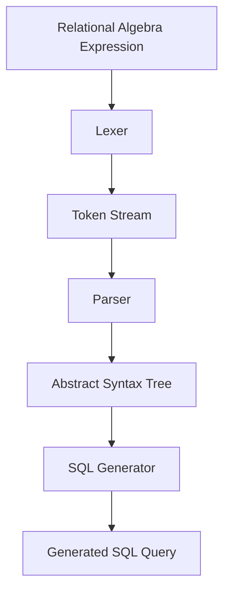
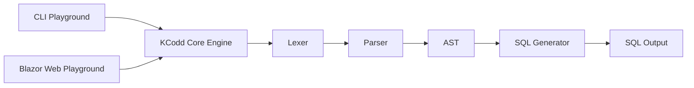

# KCodd

<p align="center">
  
</p>

<p align="center">
  <strong>Relational Algebra → SQL Transpiler</strong>
</p>

<p align="center">
  π  σ  ⋈  ρ  ∪  ∩
</p>

<p align="center">
  A lightweight compiler-style engine for parsing relational algebra expressions,
  building ASTs, and transpiling them into SQL queries.
</p>

---

> *Kern* — the core beneath everything.  
> *Codd* — Edgar F. Codd, who gave the relational model to the world.

KCodd is a relational algebra engine born from curiosity about database internals — how queries really work beneath the surface of SQL.

It parses relational algebra expressions, builds Abstract Syntax Trees (ASTs), and generates readable SQL targeting standard SQL dialects.

---

## Current Status

> Current version: `v1.0.0`
> Active Developpement 

### Supported Operators

| Operator | Symbol | Status |
|---|---|---|
| Selection | σ | ✅ |
| Projection | π | ✅ |
| Rename | ρ | ✅ |
| Natural Join | ⋈ | ✅ |
| Theta Join | ⋈θ | ✅ |
| Union | ∪ | ✅ |
| Intersection | ∩ | ✅ |
| Difference | − | ✅ |

---

## What it is

Most developers write SQL without ever thinking about what it means mathematically.

KCodd goes in the opposite direction:

Start from relational algebra, understand the primitives, construct the logical query tree, and let SQL emerge as a consequence of the transformation pipeline.

This project is for people interested in:
- database internals,
- compiler architecture,
- parsing systems,
- AST transformations,
- query optimization,
- relational theory.

---

## Features

### ✅ Currently supported

- **Selection (σ)** — filter rows with complex boolean conditions
  - Comparison operators: `=`, `≠`, `>`, `≥`, `<`, `≤`
  - Logical operators: `∧` (AND), `∨` (OR), `¬` (NOT)
  - Nested conditions with parentheses
  - String and numeric literals

- **Projection (π)** — select specific columns with duplicate elimination
  - Single or multiple attribute lists
  - Set semantics (`DISTINCT` in SQL)

- **Natural Join (⋈)** — join relations on all common attribute names
  - Automatic attribute matching
  - Multi-table join chains

- **Theta Join (⋈θ)** — join with arbitrary conditions
  - Generalizes natural join
  - Supports any boolean condition

- **Rename (ρ)** — alias relations for disambiguation
  - Essential for self-joins and complex queries

- **Union (∪)** — combine rows from two union-compatible relations
  - Set union semantics (duplicates eliminated)

- **Intersection (∩)** — find common rows between two relations

- **Difference (−)** — subtract one relation from another

- **Complex expressions**
  - Arbitrarily nested operators
  - Deep expression composition
  - Proper operator precedence handling

---

## Planned Features

- Cartesian Product (×)
- Outer Joins: Left (⟕), Right (⟖), Full (⟗)
- Division (÷)
- Duplicate Elimination (δ)
- Aggregation & Grouping (γ)
- Sorting (τ)
- SQL dialect specialization
- Semantic/schema validation
- Optimized AST
- AST visualization

---

# Quick Start

## CLI Playground

```bash
cd playground/cli
dotnet run
```

### Example Queries

```text
σ [age > 18] (Student)

π [name, gpa] (Student)

Student ⋈ Enrolled

Student ⋈θ [Student.id = Enrolled.student_id] Enrolled

(Student ∪ Alumni)

(Student ∩ HonorStudents)

(Student − GraduatedStudents)
```

### CLI Preview

<p align="center">


</p>

---

## Web Playground

```bash
cd playground/webBlazor
dotnet run
```

Open:

```text
https://localhost:7200
```

for the interactive Blazor playground.

### Web Preview
<p align="center">


</p>

---

# Grammar

```ebnf
expression ::= projection
             | selection
             | join
             | rename
             | union
             | intersection
             | difference
             | relation
             | "(" expression ")"

projection ::= ("π" | "PROJECT")
               "[" attribute_list "]"
               "(" expression ")"

selection ::= ("σ" | "SELECT")
              "[" condition "]"
              "(" expression ")"

natural-join ::= expression ("⋈" | "JOIN") expression

theta-join ::= expression "⋈θ"
               "[" condition "]"
               expression

rename ::= ("ρ" | "RENAME")
           identifier
           "(" expression ")"

union ::= expression "∪" expression

intersection ::= expression "∩" expression

difference ::= expression "−" expression

condition ::= disjunction

disjunction ::= conjunction
                (("∨" | "OR") conjunction)*

conjunction ::= negation_expr
                (("∧" | "AND") negation_expr)*

negation_expr ::= ("¬" | "NOT") negation_expr
                | comparison
                | "(" condition ")"

comparison ::= operand comparator operand

comparator ::= "=" | "≠" | "<" | ">" | "<=" | ">="
```

See [`src/grammar/grammar.ebnf`](src/grammar/grammar.ebnf) for the complete formal grammar.

---

# Examples

## Selection with complex condition

```text
σ [age > 18 ∧ gpa ≥ 3.0] (Student)
```

```sql
SELECT *
FROM Student
WHERE age > 18 AND gpa >= 3.0;
```

---

## Projection after selection

```text
π [name, gpa] (σ [age > 18] (Student))
```

```sql
SELECT DISTINCT name, gpa
FROM Student
WHERE age > 18;
```

---

## Natural Join

```text
Student ⋈ Enrolled
```

```sql
SELECT *
FROM Student
NATURAL JOIN Enrolled;
```

---

## Theta Join

```text
Student ⋈θ [Student.id = Enrolled.student_id] Enrolled
```

```sql
SELECT *
FROM Student
JOIN Enrolled
ON Student.id = Enrolled.student_id;
```

---

## Union

```text
(Student ∪ Alumni)
```

```sql
SELECT *
FROM Student
UNION
SELECT *
FROM Alumni;
```

---

## Intersection

```text
(Student ∩ HonorStudents)
```

```sql
SELECT *
FROM Student
INTERSECT
SELECT *
FROM HonorStudents;
```

---

## Difference

```text
(Student − GraduatedStudents)
```

```sql
SELECT *
FROM Student
EXCEPT
SELECT *
FROM GraduatedStudents;
```

---

## Multi-table pipeline

```text
π [name, title]
(
    Student
    ⋈θ [Student.id = Enrolled.student_id] Enrolled
    ⋈θ [Enrolled.course_id = Course.id] Course
)
```

```sql
SELECT DISTINCT name, title
FROM Student
JOIN Enrolled
    ON Student.id = Enrolled.student_id
JOIN Course
    ON Enrolled.course_id = Course.id;
```

---

# Architecture

## Project Structure

```text
kcodd/
├── src/
│   ├── core/           # AST node definitions and core logic
│   ├── lexer/          # Lexical analysis
│   ├── parser/         # Syntax parsing
│   ├── sqlgenerator/   # SQL code generation
│   ├── transpiler/     # Main transpilation service
│   └── grammar/        # Formal grammar definitions
│
├── playground/
│   ├── cli/            # Command-line playground
│   └── webBlazor/      # Blazor web playground
│
├── tests/              # Unit and integration tests
│
└── docs/
    ├── RELATIONAL_ALGEBRA.md
    ├── architecture.md
    └── learning-roadmap.md
```

---

## Transpilation Pipeline



---

## Playground Architecture



---

## Design Principles

- **Composability** — operators can nest arbitrarily
- **Set semantics** — pure relational algebra behavior
- **Optimization-first** — logical rewrites before generation
- **Extensibility** — clean operator-oriented architecture
- **Compiler-oriented design** — lexer → parser → AST → optimization → generation
- **Standards compliance** — targets standard SQL dialects

---

# Building

```bash
# Build everything
dotnet build kcodd.sln

# Run tests
dotnet test tests/tests.csproj

# Run CLI playground
dotnet run --project playground/cli/cli.csproj

# Run Web playground
dotnet run --project playground/webBlazor/webBlazor.csproj
```

### Prerequisites

- .NET 9 or later

---

# Current Limitations

- No semantic/schema validation yet
- Targets generic SQL dialects
- No physical query execution engine
- Optimizer currently performs logical rewrites only
- No aggregation support yet

---

# Why KCodd

The name carries the two ideas that motivated the project.

### Kern

The innermost layer.

The desire to go beneath the ORM, beneath the query planner, beneath SQL syntax itself — down to the mathematical primitives that define relational databases.

### Codd

Edgar F. Codd (1923–2003), IBM researcher and creator of the relational model.

Every modern SQL database traces back to his 1970 paper:

> *A Relational Model of Data for Large Shared Data Banks*

KCodd is a small attempt to understand those foundations directly.

---

# Documentation

- [Relational Algebra Reference](docs/RELATIONAL_ALGEBRA.md)
- [Architecture Notes](docs/architecture.md)
- [Learning Roadmap](docs/learning-roadmap.md)

---

